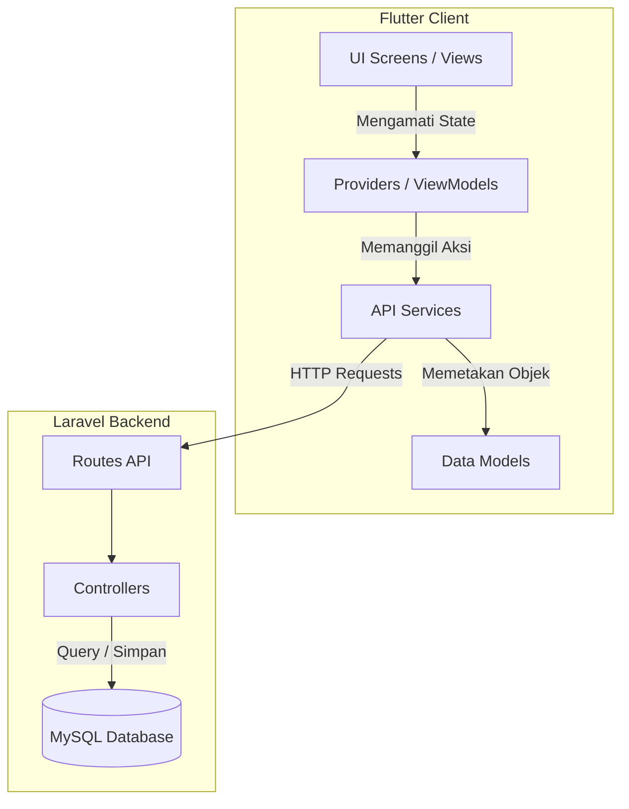

# DOKUMENTASI LENGKAP PROYEK INCITRACK MOBILE
## Panduan Kode, Arsitektur Sistem, dan Integrasi REST API (Bahan Ajar)

Dokumen ini disusun sebagai materi penjelasan teknis dan bahan ajar pemrograman mobile berbasis **Flutter** dan **Laravel** (REST API) pada proyek **Incitrack Mobile**. Proyek ini merupakan aplikasi pelaporan insiden/kecelakaan lalu lintas jalan tol di Indonesia secara real-time yang didukung oleh pemetaan berbasis geografis (GPS).

---

## 1. PENDAHULUAN & ARSITEKTUR SISTEM

Aplikasi ini menggunakan pola arsitektur **MVVM (Model-View-ViewModel)** dengan pemisahan tanggung jawab (*Separation of Concerns*) yang jelas untuk memudahkan skalabilitas dan pengujian kode:



### Komponen Utama Arsitektur:
1. **Models (Data Layer):** Merepresentasikan skema data objek yang diperoleh dari database. Bertanggung jawab atas serialization dan deserialization JSON secara aman.
2. **Views (UI Layer):** Widget Flutter (`Stateless` & `Stateful`) yang hanya bertugas menggambar antarmuka pengguna sesuai *state* terkini.
3. **Providers / ViewModels (State Management):** Menggunakan paket `provider`. Mengelola logika aplikasi, mengubah data mentah dari *Service* menjadi *State* yang siap digunakan UI, dan menyiarkan perubahan menggunakan `notifyListeners()`.
4. **Services (Network Layer):** Kelas helper statis yang merangkum semua panggilan jaringan HTTP ke backend Laravel menggunakan metode Multipart maupun JSON.

---

## 2. STRUKTUR DIREKTORI PROYEK

Struktur folder pada direktori `/lib` diatur secara modular:

```text
lib/
├── core/
│   └── theme/
│       └── app_theme.dart      # Konfigurasi palet warna & tema global (Material 3)
├── models/
│   ├── user_model.dart         # Pemetaan data profil pengguna (User)
│   ├── jalan_model.dart        # Pemetaan data ruas jalan tol (Jalan)
│   └── laporan_model.dart      # Pemetaan data laporan insiden (Laporan)
├── providers/
│   ├── auth_provider.dart      # Manajemen session login, registrasi, & auto-login
│   ├── jalan_provider.dart     # Penyimpanan & pengambilan list ruas jalan tol
│   └── laporan_provider.dart   # Logika pengiriman & riwayat laporan kecelakaan
├── services/
│   └── api_service.dart        # Klien HTTP terpadu (OAuth Token & Multipart Upload)
├── screens/
│   ├── auth/
│   │   ├── login_screen.dart   # Layar masuk akun
│   │   └── register_screen.dart# Layar buat akun baru
│   ├── beranda/
│   │   └── beranda_screen.dart # Layar sekunder (opsional)
│   ├── home/
│   │   └── home_screen.dart    # Dashboard Peta Interaktif (OpenStreetMap)
│   ├── lapor/
│   │   └── lapor_screen.dart   # Form Laporan dengan GPS & Upload Kamera
│   ├── riwayat/
│   │   └── riwayat_screen.dart # Histori laporan khusus milik pengguna
│   ├── pengaturan/
│   │   └── pengaturan_screen.dart # Edit profil & aksi Logout
│   └── main_screen.dart        # Bottom Navigation Bar sebagai wadah utama
└── main.dart                   # Entry point aplikasi & inisialisasi MultiProvider
```

---

## 3. ANALISIS DEPENDENSI (`pubspec.yaml`)

Aplikasi ini didukung oleh pustaka (*packages*) penting dari pub.dev untuk mendukung berbagai fungsionalitas modern:

*   **`http`:** Digunakan untuk melakukan komunikasi HTTP request (GET, POST, PUT, DELETE) ke server backend Laravel.
*   **`provider`:** Pustaka manajemen *state* untuk memisahkan UI dengan logika bisnis secara reaktif.
*   **`flutter_secure_storage`:** Menyimpan data kredensial (seperti *Sanctum Auth Token*) secara terenkripsi di dalam memori aman perangkat (Keychain di iOS / Keystore di Android / LocalStorage terenkripsi di Web).
*   **`geolocator`:** Mengakses sensor GPS bawaan gawai untuk mengunci koordinat Latitude dan Longitude secara instan dan akurat.
*   **`flutter_map` & `latlong2`:** Menampilkan peta interaktif berbasis OpenStreetMap secara lokal tanpa bergantung pada Google Maps SDK yang berbayar.
*   **`image_picker`:** Membuka kamera atau galeri foto perangkat untuk mengambil bukti gambar atau rekaman video insiden kecelakaan.
*   **`intl`:** Menyediakan lokalisasi format mata uang, angka, dan penanggalan dinamis.

---

## 4. PENJELASAN MENDALAM KODE SUMBER

### A. Lapisan Model Data (Data Models)
Model data dirancang dengan metode parsing defensif menggunakan fungsi internal `parseCoordinate` untuk menghindari kegagalan konversi tipe data dinamis (seperti dari *double* ke *string* atau sebaliknya) ketika dibaca dari JSON API Laravel.

#### file: `lib/models/laporan_model.dart`
```dart
import 'user_model.dart';
import 'jalan_model.dart';

class LaporanModel {
  final int id;
  final int userId;
  final int jalanId;
  final String jenis;
  final String lokasi;
  final double latitude;
  final double longitude;
  final String? penyebab;
  final String? dampak;
  final String? foto;
  final String? video;
  final String status;
  final String createdAt;
  final UserModel? user;
  final JalanModel? jalan;

  LaporanModel({
    required this.id,
    required this.userId,
    required this.jalanId,
    required this.jenis,
    required this.lokasi,
    required this.latitude,
    required this.longitude,
    this.penyebab,
    this.dampak,
    this.foto,
    this.video,
    required this.status,
    required this.createdAt,
    this.user,
    this.jalan,
  });

  factory LaporanModel.fromJson(Map<String, dynamic> json) {
    // Fungsi pembantu untuk mengamankan tipe koordinat dari API Laravel
    double parseCoordinate(dynamic val) {
      if (val == null) return 0.0;
      if (val is num) return val.toDouble();
      return double.tryParse(val.toString()) ?? 0.0;
    }

    return LaporanModel(
      id: json['id'] ?? 0,
      userId: json['user_id'] ?? 0,
      jalanId: json['jalan_id'] ?? 0,
      jenis: json['jenis_kecelakaan'] ?? json['jenis'] ?? '',
      lokasi: json['lokasi'] ?? '',
      latitude: parseCoordinate(json['latitude'] ?? json['lat']),
      longitude: parseCoordinate(json['longitude'] ?? json['lng']),
      penyebab: json['penyebab'],
      dampak: json['dampak'],
      foto: json['foto_bukti'] ?? json['foto'],
      video: json['video_bukti'] ?? json['video'],
      status: json['status'] ?? 'pending',
      createdAt: json['created_at'] ?? '',
      user: json['user'] != null ? UserModel.fromJson(json['user']) : null,
      jalan: json['jalan'] != null ? JalanModel.fromJson(json['jalan']) : null,
    );
  }
}
```

---

### B. Lapisan Jaringan (Network Layer)
Kelas `ApiService` mengontrol semua lalu lintas jaringan. Di dalamnya terdapat penanganan khusus deteksi server (localhost vs IP Emulator Android) dan fungsi unggah berkas multipart lintas platform (Mobile & Web).

#### file: `lib/services/api_service.dart`
```dart
import 'dart:convert';
import 'package:flutter/foundation.dart' show kIsWeb, defaultTargetPlatform, TargetPlatform;
import 'package:http/http.dart' as http;
import 'package:flutter_secure_storage/flutter_secure_storage.dart';
import 'package:image_picker/image_picker.dart';

class ApiService {
  // 1. Deteksi Base URL Fleksibel untuk Emulator Android vs Platform Lain (Web/iOS)
  static final String baseUrl = kIsWeb
      ? 'http://localhost:8000/api/'
      : (defaultTargetPlatform == TargetPlatform.android 
          ? 'http://10.0.2.2:8000/api/' 
          : 'http://localhost:8000/api/');
      
  static const _storage = FlutterSecureStorage();
  static const String _tokenKey = 'auth_token';

  // 2. Manajemen Enkripsi Penyimpanan Token (OAuth Sanctum)
  static Future<void> saveToken(String token) async {
    await _storage.write(key: _tokenKey, value: token);
  }

  static Future<String?> getToken() async {
    return await _storage.read(key: _tokenKey);
  }

  static Future<void> deleteToken() async {
    await _storage.delete(key: _tokenKey);
  }

  // 3. Menyiapkan Header Permintaan Otomatis
  static Future<Map<String, String>> _getHeaders() async {
    final token = await getToken();
    return {
      'Accept': 'application/json',
      'Content-Type': 'application/json',
      if (token != null) 'Authorization': 'Bearer $token',
    };
  }

  // 4. Metode POST Multipart Upload Lintas Platform (Mendukung Web & Mobile)
  static Future<Map<String, dynamic>> kirimLaporan(
    Map<String, String> fields,
    XFile? fotoFile,
    XFile? videoFile,
  ) async {
    try {
      final uri = Uri.parse('${baseUrl}laporan');
      final request = http.MultipartRequest('POST', uri);
      
      final headers = await _getHeaders();
      request.headers.addAll(headers);
      request.headers.remove('Content-Type'); // Biarkan HttpClient membuat batas boundary otomatis

      request.fields.addAll(fields);

      // Lampirkan Foto
      if (fotoFile != null) {
        if (kIsWeb) {
          // Membaca file sebagai bytes pada platform web
          final bytes = await fotoFile.readAsBytes();
          request.files.add(http.MultipartFile.fromBytes(
            'foto',
            bytes,
            filename: fotoFile.name,
          ));
        } else {
          // Membaca dari jalur sistem (path) pada platform Android / iOS
          request.files.add(await http.MultipartFile.fromPath(
            'foto',
            fotoFile.path,
          ));
        }
      }

      // Lampirkan Video (Logika yang sama seperti foto)
      if (videoFile != null) {
        if (kIsWeb) {
          final bytes = await videoFile.readAsBytes();
          request.files.add(http.MultipartFile.fromBytes(
            'video',
            bytes,
            filename: videoFile.name,
          ));
        } else {
          request.files.add(await http.MultipartFile.fromPath(
            'video',
            videoFile.path,
          ));
        }
      }

      final streamedResponse = await request.send();
      final response = await http.Response.fromStream(streamedResponse);
      return jsonDecode(response.body);
    } catch (e) {
      return {'success': false, 'message': 'Gagal mengirim laporan: $e'};
    }
  }
}
```

---

### C. Lapisan State Management (Providers)
Providers bertindak sebagai perekat reaktif. Mereka memicu panggilan API, menangani status pemuatan (*loading state*), dan menangani pesan kegagalan secara terpusat.

#### file: `lib/providers/laporan_provider.dart`
```dart
import 'package:flutter/material.dart';
import 'package:image_picker/image_picker.dart';
import '../models/laporan_model.dart';
import '../services/api_service.dart';

class LaporanProvider with ChangeNotifier {
  List<LaporanModel> _laporans = [];
  List<LaporanModel> _userLaporans = [];
  bool _isLoading = false;
  String? _errorMessage;

  List<LaporanModel> get laporans => _laporans;
  List<LaporanModel> get userLaporans => _userLaporans;
  bool get isLoading => _isLoading;
  String? get errorMessage => _errorMessage;

  // Mengambil Semua Laporan Valid untuk Ditampilkan di Peta
  Future<void> fetchAllLaporans() async {
    _isLoading = true;
    _errorMessage = null;
    notifyListeners();

    try {
      final response = await ApiService.fetchLaporan();
      if (response['success'] == true && response['data'] != null) {
        final List<dynamic> listData = response['data'];
        _laporans = listData.map((json) => LaporanModel.fromJson(json)).toList();
        _errorMessage = null;
      } else {
        _errorMessage = response['message'] ?? 'Gagal memuat laporan.';
      }
    } catch (e) {
      _errorMessage = 'Terjadi kesalahan koneksi: $e';
    }

    _isLoading = false;
    notifyListeners();
  }

  // Kirim Laporan dengan data lengkap termasuk tanggal dan waktu otomatis
  Future<bool> kirimLaporan({
    required int jalanId,
    required String jenisKecelakaan,
    required String lokasi,
    required double latitude,
    required double longitude,
    String? penyebab,
    String? dampak,
    XFile? fotoFile,
    XFile? videoFile,
  }) async {
    _isLoading = true;
    _errorMessage = null;
    notifyListeners();

    try {
      final now = DateTime.now();
      final Map<String, String> fields = {
        'jalan_id': jalanId.toString(),
        'jenis': jenisKecelakaan,
        'lokasi': lokasi,
        'lat': latitude.toString(),
        'lng': longitude.toString(),
        'tanggal': '${now.year}-${now.month.toString().padLeft(2, '0')}-${now.day.toString().padLeft(2, '0')}',
        'waktu': '${now.hour.toString().padLeft(2, '0')}:${now.minute.toString().padLeft(2, '0')}',
      };

      if (penyebab != null && penyebab.isNotEmpty) fields['penyebab'] = penyebab;
      if (dampak != null && dampak.isNotEmpty) fields['dampak'] = dampak;

      final response = await ApiService.kirimLaporan(fields, fotoFile, videoFile);
      
      if (response['success'] == true) {
        _isLoading = false;
        notifyListeners();
        return true;
      } else {
        _errorMessage = response['message'] ?? 'Gagal mengirimkan laporan.';
      }
    } catch (e) {
      _errorMessage = 'Terjadi kesalahan pengunggahan: $e';
    }

    _isLoading = false;
    notifyListeners();
    return false;
  }
}
```

---

## 5. ALUR INTEGRASI BACKEND LARAVEL API

Backend Laravel berfungsi sebagai penyedia REST API untuk menyimpan laporan dan memberikan otentikasi JWT token (Laravel Sanctum).

### Pengendali Pengiriman (`LaporanApiController.php`)
Di sisi server Laravel, ketika rute `POST /api/laporan` dipanggil, Laravel akan:
1. Memvalidasi parameter masukan wajib:
   ```php
   $request->validate([
       'jalan_id' => 'required',
       'tanggal'  => 'required|date',
       'waktu'    => 'required',
       'lokasi'   => 'required',
       'jenis'    => 'required',
       'lat'      => 'required',
       'lng'      => 'required'
   ]);
   ```
2. Memeriksa keberadaan file (`foto` & `video`), mengubah namanya menggunakan *timestamp* unik, dan memindahkannya ke direktori publik `/uploads`.
3. Membuat record laporan baru di database dengan status bawaan `'pending'`.
4. Mengembalikan respons JSON dengan status HTTP `201 Created`.

---

## 6. LANGKAH-LANGKAH MENJALANKAN PROYEK

Aplikasi ini dapat dijalankan menggunakan server lokal secara mudah:

### Tahap 1: Setup Database & Server API Laravel
1. Jalankan aplikasi **MAMP/XAMPP** dan pastikan MySQL Server aktif.
2. Salin dan edit berkas `.env` di proyek Laravel Anda:
   ```env
   DB_CONNECTION=mysql
   DB_HOST=127.0.0.1
   DB_PORT=8111          # Sesuaikan dengan port MySQL MAMP aktif Anda
   DB_DATABASE=incitrack
   DB_USERNAME=root
   DB_PASSWORD=root      # Sandi bawaan MAMP
   ```
3. Pindah ke direktori web dan pasang semua pustaka PHP:
   ```powershell
   composer install
   ```
4. Lakukan migrasi skema tabel dan isi data toll jalan awal:
   ```powershell
   php artisan migrate --seed
   ```
5. Nyalakan server lokal Laravel:
   ```powershell
   php artisan serve
   ```
   *(Server akan mendengarkan di http://127.0.0.1:8000)*

### Tahap 2: Menjalankan Aplikasi Flutter
1. Masuk ke folder proyek Flutter `Incitrack_Mobile`.
2. Unduh semua paket dependensi:
   ```powershell
   flutter pub get
   ```
3. Jalankan aplikasi menggunakan browser Chrome untuk pengujian Web:
   ```powershell
   flutter run -d chrome
   ```
4. Masuk menggunakan akun bawaan hasil seeder:
   *   **Email:** `test@example.com`
   *   **Kata Sandi:** `password123`
